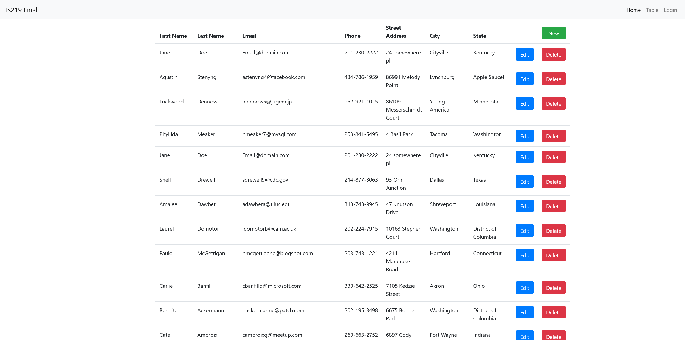
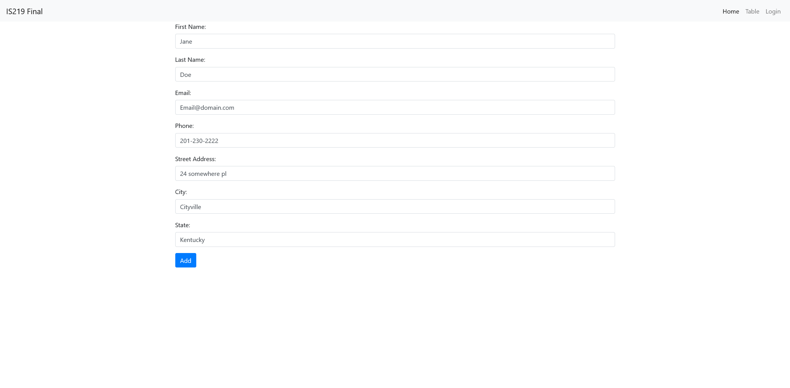
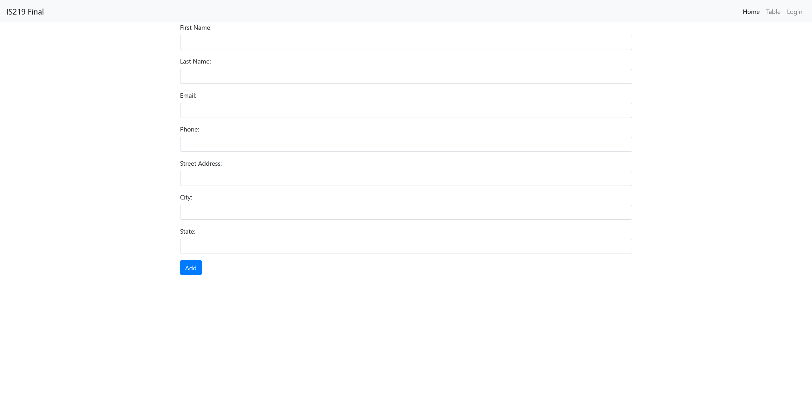
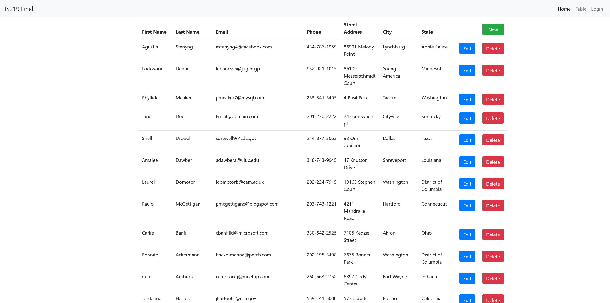

<!--
*** Thanks for checking out the Best-README-Template. If you have a suggestion
*** that would make this better, please fork the repo and create a pull request
*** or simply open an issue with the tag "enhancement".
*** Thanks again! Now go create something AMAZING! :D
***
***
***
*** To avoid retyping too much info. Do a search and replace for the following:
*** github_username, repo_name, twitter_handle, email, project_title, project_description
-->

<!-- PROJECT SHIELDS -->
<!--
*** I'm using markdown "reference style" links for readability.
*** Reference links are enclosed in brackets [ ] instead of parentheses ( ).
*** See the bottom of this document for the declaration of the reference variables
*** for contributors-url, forks-url, etc. This is an optional, concise syntax you may use.
*** https://www.markdownguide.org/basic-syntax/#reference-style-links
-->
[![Contributors][contributors-shield]][contributors-url]
[![Forks][forks-shield]][forks-url]
[![Stargazers][stars-shield]][stars-url]
[![Issues][issues-shield]][issues-url]

 
<h3 align="center">IS 219 Final Project</h3>

  

    Final Project for my IS 219 course

<!-- ABOUT THE PROJECT -->
## Project Screen Shots

#### Main Table Unedited

#### Edit Form for row on table

#### New Form for row on table

#### Table after first row deleted

<!-- MARKDOWN LINKS & IMAGES -->
<!-- https://www.markdownguide.org/basic-syntax/#reference-style-links -->
[contributors-shield]: https://img.shields.io/github/contributors/itanne99/IS219-Final-Project.svg?style=for-the-badge
[contributors-url]: https://github.com/itanne99/IS219-Final-Project/graphs/contributors
[forks-shield]: https://img.shields.io/github/forks/itanne99/IS219-Final-Project.svg?style=for-the-badge
[forks-url]: https://github.com/itanne99/IS219-Final-Project/network/members
[stars-shield]: https://img.shields.io/github/stars/itanne99/IS219-Final-Project.svg?style=for-the-badge
[stars-url]: https://github.com/itanne99/IS219-Final-Project/stargazers
[issues-shield]: https://img.shields.io/github/issues/itanne99/IS219-Final-Project.svg?style=for-the-badge
[issues-url]: https://github.com/itanne99/IS219-Final-Project/issues
